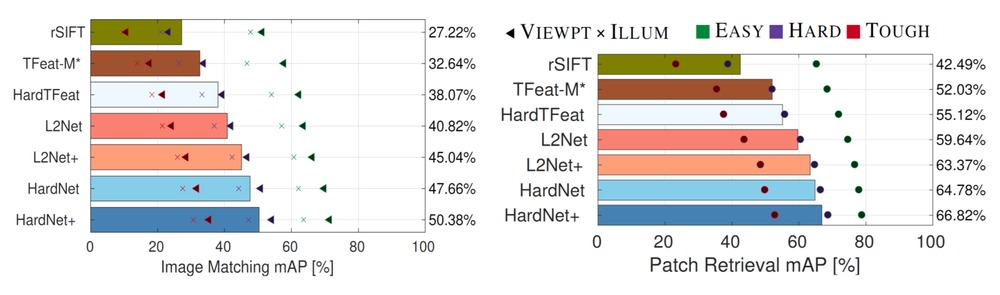

# HardNet model implementation

HardNet model implementation in PyTorch for NIPS 2017 paper ["Working hard to know your neighbor's margins: Local descriptor learning loss"](https://arxiv.org/abs/1705.10872)
[poster](http://cmp.felk.cvut.cz/~mishkdmy/posters/hardnet2017.pdf), [slides](http://cmp.felk.cvut.cz/~mishkdmy/slides/HardNet2017.pdf)

## Benchmark on [HPatches](https://github.com/hpatches/hpatches-benchmark), mAP



## Retrieval on Oxford5k, mAP

| Descriptor    | BoW  |  BoW + SV | BoW + SV + QE | HQE + MA |
| -----    | ----  |  ---- | ---- | ---- |
| [TFeatLib](https://github.com/vbalnt/tfeat)   | 46.7  |  55.6 | 72.2 | n/a |
| [RootSIFT](http://ieeexplore.ieee.org/document/6248018/)    | 55.1  |  63.0 | 78.4 | 88.0 |
| [L2NetLib+](https://github.com/yuruntian/L2-Net)   | 59.8  |  67.7 | 80.4 | n/a |
| HardNetLib+   | 59.8  |  68.6 | 83.0 |  88.2 |
| HardNet++   | **60.8**  |  **69.6** | **84.5** | **88.3** |


## Requirements

Please use Python 2.7, install OpenCV and additional libraries from requirements.txt

## Datasets and Training

To download datasets and start learning descriptor:

```bash
git clone https://github.com/DagnyT/hardnet
./run_me.sh
```

Logs are stored in tensorboard format in directory logs/

## Pre-trained models

Pre-trained models can be found in folder pretrained:  train_liberty and train_liberty_with_aug

## Usage example

We provide an example, how to describe patches with HardNet. Script expects patches in [HPatches](https://github.com/hpatches/hpatches-benchmark) format, i.e. grayscale image with w = patch_size and h = n_patches * patch_size
```
cd examples
python extract_hardnet_desc_from_hpatches_file.py imgs/ref.png out.txt
```
or with Caffe:
```    
cd examples/caffe
python extract_hardnetCaffe_desc_from_hpatches_file.py ../imgs/ref.png hardnet_caffe.txt
```

## Citation

Please cite us if you use this code:

```
@article{HardNet2017,
 author = {Anastasiya Mishchuk, Dmytro Mishkin, Filip Radenovic, Jiri Matas},
    title = "{Working hard to know your neighbor's margins: Local descriptor learning loss}",
    booktitle = {Proceedings of NIPS},
     year = 2017,
    month = dec}
```
