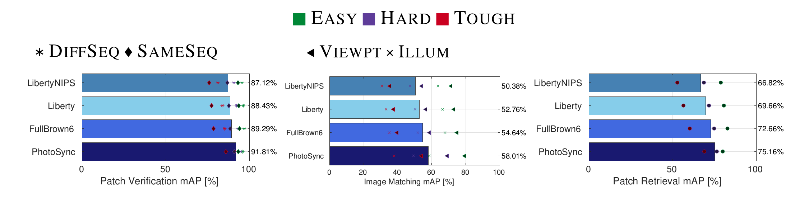

# HardNet model implementation

HardNet model implementation in PyTorch for NIPS 2017 paper ["Working hard to know your neighbor's margins: Local descriptor learning loss"](https://arxiv.org/abs/1705.10872)
[poster](http://cmp.felk.cvut.cz/~mishkdmy/posters/hardnet2017.pdf), [slides](http://cmp.felk.cvut.cz/~mishkdmy/slides/HardNet2017.pdf)

## Important update
After two major updates of PyTorch library, we were not able to reproduce the results. Therefore, we did a hyperparameter search and we found that increasing the learning rate to 10 and dropout rate to 0.3 leads to better results, see figure below. We have obtained the same results on different machines
. We will update arXiv version soon.  
Pretrained weights in PyTorch format are updated.

We also release version, trained on all subsets of Brown dataset, called [HardNet6Brown]('pretrained/6Brown).


## Benchmark on [HPatches](https://github.com/hpatches/hpatches-benchmark), mAP


## Retrieval on Oxford5k, mAP, Hessian-Affine detector

| Descriptor    | BoW  |  BoW + SV | BoW + SV + QE | HQE + MA |
| -----    | ----  |  ---- | ---- | ---- |
| [TFeatLib](https://github.com/vbalnt/tfeat)   | 46.7  |  55.6 | 72.2 | n/a |
| [RootSIFT](http://ieeexplore.ieee.org/document/6248018/)    | 55.1  |  63.0 | 78.4 | 88.0 |
| [L2NetLib+](https://github.com/yuruntian/L2-Net)   | 59.8  |  67.7 | 80.4 | n/a |
| HardNetLibNIPS+   | 59.8  |  68.6 | 83.0 |  88.2 |
| HardNet++   | **60.8**  |  **69.6** | **84.5** | **88.3** |
| [HesAffNet](https://github.com/ducha-aiki/affnet) + HardNet++ | **68.3**  |  **77.8** | **89.0** | **89.5** |


## Requirements

Please use Python 2.7, install OpenCV and additional libraries from requirements.txt

## Datasets and Training

To download datasets and start learning descriptor:

```bash
git clone https://github.com/DagnyT/hardnet
./run_me.sh
```

Logs are stored in tensorboard format in directory logs/

## Pre-trained models

Pre-trained models can be found in folder [pretrained](pretrained).

## 3rd party pre-trained models

Rahul Mitra presented new [large-scale patch PS-dataset](https://github.com/rmitra/PS-Dataset) and trained even better HardNet on it. Original weights in torch format are [here](https://www.dropbox.com/s/q89g5kfuke6c348/hardnet-PS.t7?dl=1).

Converted PyTorch version is [here](pretrained/3rd_party/HardNetPS/).




## Which weights should I use?

For practical applications, we recommend [HardNet++](pretrained/pretrained_all_datasets/HardNet++.pth').

For comparison with other descriptors, which are trained on Liberty Brown dataset, we recommend [HardNetLib+](pretrained/train_liberty_with_aug/checkpoint_liberty_with_aug.pth).

For the best descriptor, which is NOT trained on HPatches dataset, we recommend model by Mitra et.al., link in section above.

## Usage example

We provide an example, how to describe patches with HardNet. Script expects patches in [HPatches](https://github.com/hpatches/hpatches-benchmark) format, i.e. grayscale image with w = patch_size and h = n_patches * patch_size
```
cd examples
python extract_hardnet_desc_from_hpatches_file.py imgs/ref.png out.txt
```
or with Caffe:
```    
cd examples/caffe
python extract_hardnetCaffe_desc_from_hpatches_file.py ../imgs/ref.png hardnet_caffe.txt
```

## Projects, which use HardNet

[AffNet](https://github.com/ducha-aiki/affnet) -- learned local affine shape estimator.


## Citation

Please cite us if you use this code:

```
@article{HardNet2017,
 author = {Anastasiya Mishchuk, Dmytro Mishkin, Filip Radenovic, Jiri Matas},
    title = "{Working hard to know your neighbor's margins: Local descriptor learning loss}",
    booktitle = {Proceedings of NIPS},
     year = 2017,
    month = dec}
```
